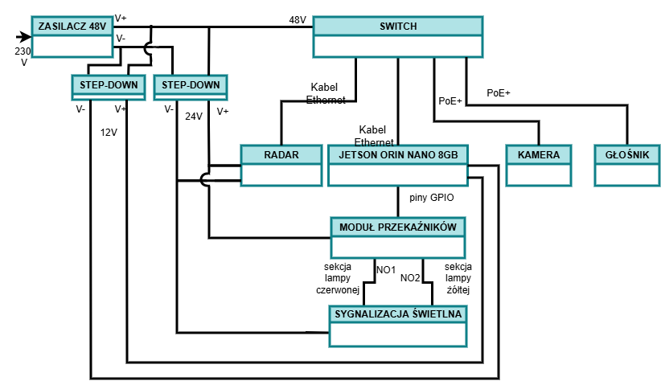

# Architektura sprzętowa systemu wczesnego ostrzegania na przejściach dla pieszych 
Raport zawiera listę i opis komponentów platformy docelowej wybranych bezwzględu na budżet.

## Schemat blokowy

## Lista komponentów
1. Jednostka centralna: Jetson Orin Nano 8GB
2. Sensor radarowy: TRUGRD LR firmy smartmicro
3. System wizyjny: AXIS P1488-LE Bullet Camera
4. System ostrzegawczy:
* świetlny: sygnalizatory drogowe Grupy ZIR, dwukomorowy w kolorach żółty i czerwony
* dźwiękowy:  AXIS C1310-E Mk II Network Horn Speaker
5. System komunikacyjny: Ethernet Switch ISW-514PTF-v4 firmy  PLANET 
6. Moduł wykonawczy: Moduł 4 przekaźników z optoizolacją KAmodRPi PwrRELAY4
7. Zasilacz Impulsowy Mean Well MEAN WELL NDR-240-48, 5 A, 240 W
8. Przetwornice:
* Mean Well SD-150C-24 48V/24V 6,3A
* Mean Well SD-150C-12 48/12V 150W (12.5A) 

##  Opis techniczny
Jednostkę centralną systemu stanowi komputer AI NVIDIA Jetson Orin Nano 8GB. Dzięki architekturze NVIDIA Ampere z 1024 rdzeniami CUDA, moduł ten zapewnia ogromną wydajność obliczeniową do 67 TOPS, co pozwala na równoległe przetwarzanie strumienia wideo 4K oraz danych radarowych w czasie rzeczywistym.

System wizyjny oparto na profesjonalnej kamerze sieciowej AXIS P1485-LE. Urządzenie to wyposażone jest w sensor 4K oraz zmiennoogniskowy obiektyw 10.8–28.2 mm, który pozwala na precyzyjne ustawienie wąskiego pola widzenia FOV  14°. Kamera posiada zintegrowane technologie Lightfinder 2.0 oraz Forensic WDR, optymalizujące obraz pod kątem detekcji pojazdów w skrajnie trudnych warunkach oświetleniowych i pogodowych.

Sensor radarowy TRUGRD LR został wybrany ze względu na zasięg detekcji od 3 do 500 m oraz wysoką dokładność pozycjonowania obiektów. Radar pracuje w trybie ciągłym, skanując drogę i przesyłając pakiety danych o prędkości, odległości i klasyfikacji obiektów bezpośrednio do jednostki centralnej poprzez interfejs Ethernet, co gwarantuje wysoką przepustowość i stabilność transmisji.

System komunikacyjny opiera się na przemysłowym switchu PLANET ISW-514PTF-v4. Pełni on rolę centralnego węzła sieciowego, łączącego wszystkie komponenty IP. Switch wyposażony jest w funkcję Power Boost, która pozwala na zasilanie kamery oraz głośnika w standardzie PoE+ (802.3at). 

System ostrzegawczy składa się z dwóch niezależnych modułów:
* Wizualnego: wykorzystującego dwukomorowy, drogowy sygnalizator LED Grupy ZIR w kolorach żółtym, ostrzegawczym oraz czerwonym, alarmowym. 
* Dźwiękowego: opartego na głośniku IP AXIS C1310-E Mk II. 

Moduł wykonawczy KAmodRPi PwrRELAY4 pośredniczy w sterowaniu sygnalizatorem świetlnym. Pełni on rolę izolatora galwanicznego, skutecznie oddzielając piny GPIO układu Jetson od obwodów wykonawczych 48 V. Zastosowanie optoizolacji chroni jednostkę centralną przed przepięciami oraz potencjalnymi skutkami zwarć w obwodzie zasilania lamp drogowych.

Zasilanie większości komponentów zapewnia zasilacz impulsowy MEAN WELL NDR-240-48, 5 A, 240 W. Pokrywa on zapotrzebowanie energetyczne switcha sieciowego oraz urządzeń PoE+. Zasilacz ten stanowi również źródło prądu dla radaru oraz sygnalizacji świetlnej, których napięcie robocze jest obniżane do 24 V DC za pomocą dedykowanej przetwornicy step-down. Jednostka Jetson Orin Nano zasilana dzięki przetwornic step-down napięciem 12V. 
