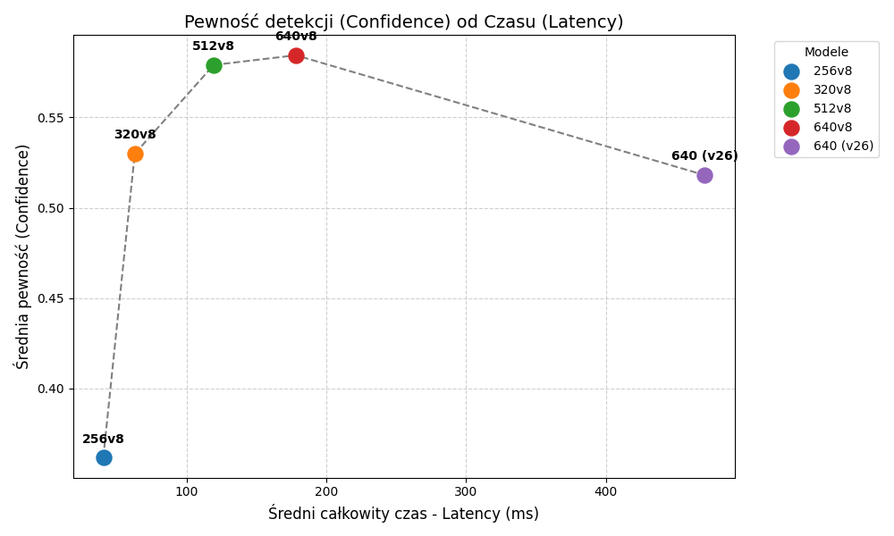
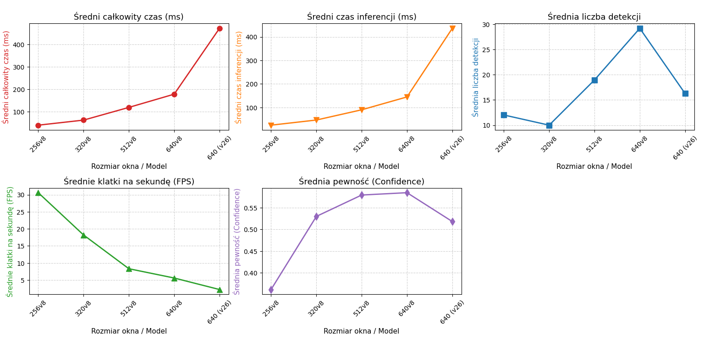

# YOLO Models Performance Analysis

In this report, we compare the performance of different model variants based on window size and resolution.
The models analyzed are YOLOv8n for window size: 256, 320, 512, 640 and YOLOv26 for window size 640.

## Confidence vs. Latency
The chart below illustrates the trade-off between execution speed and model confidence:

## Detailed Parameters Comparison
The following charts present detailed data regarding latency, inference time, average number of detections, FPS, and confidence for each model:
