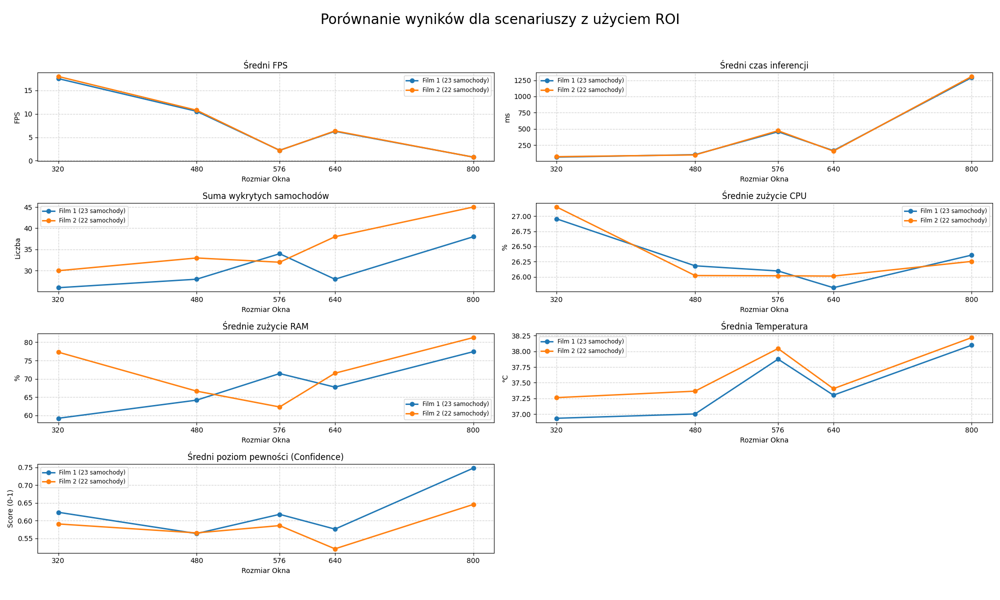
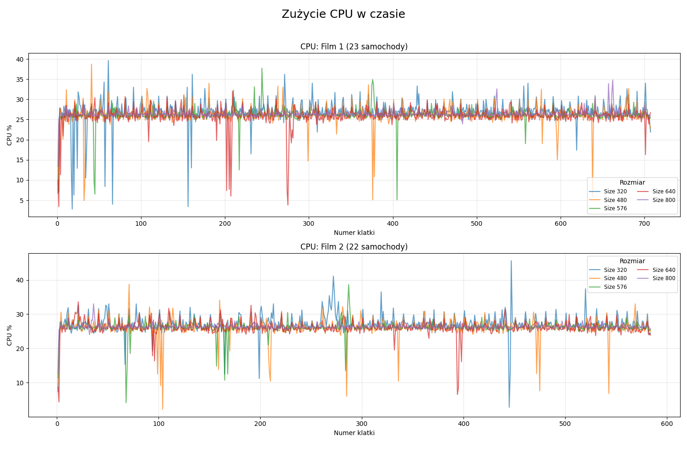
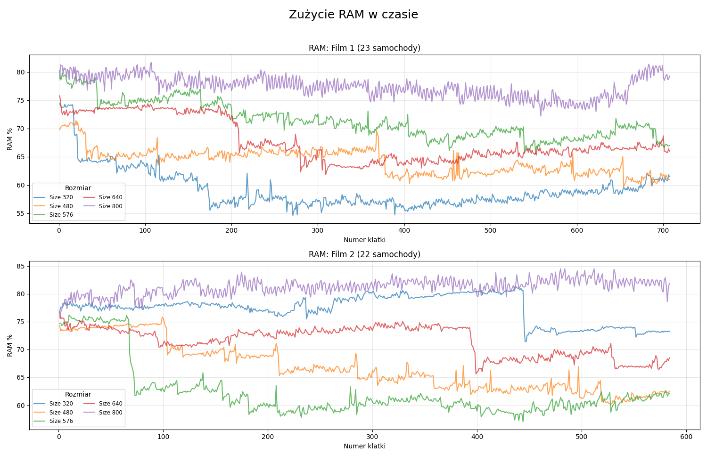
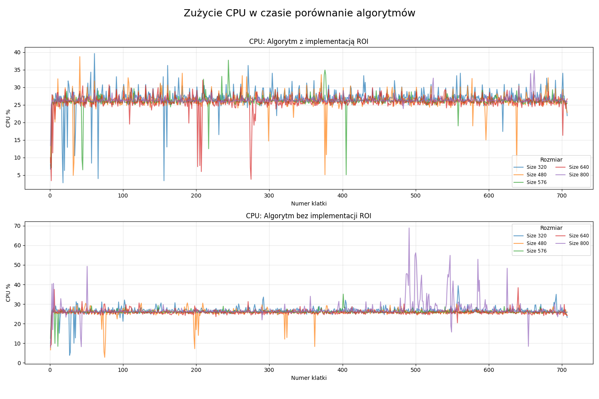
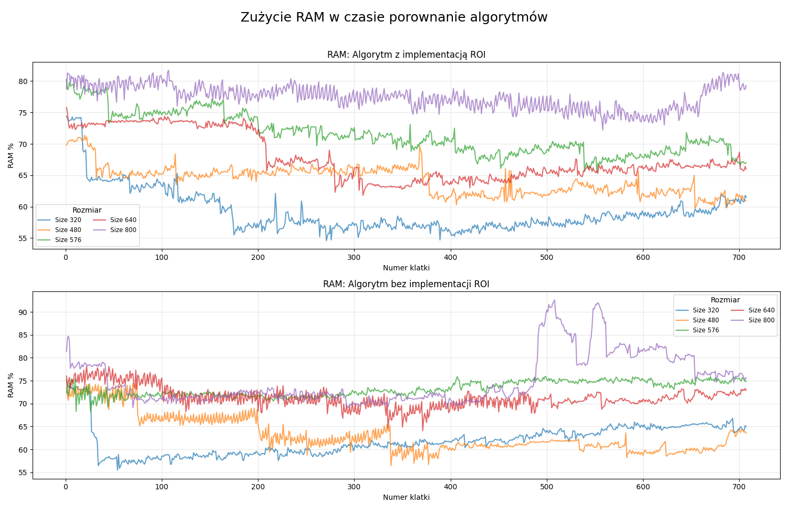
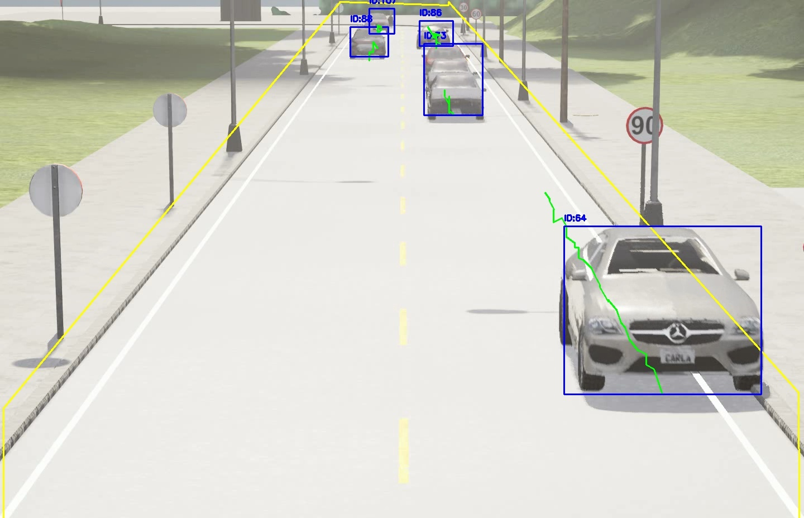
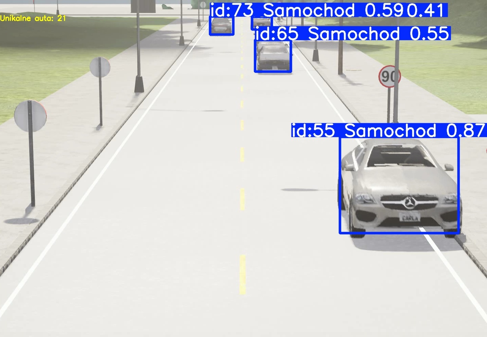
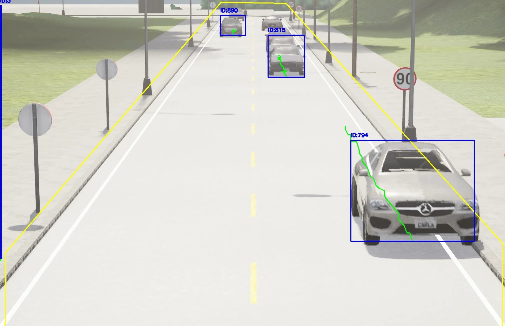
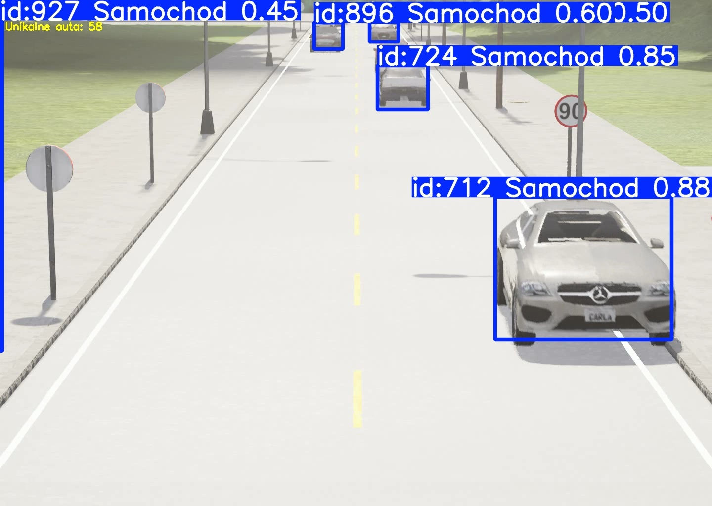

# Raport Platformy Docelowej Raspberry Pi i Google Coral
Zbadano wydajność Raspberry Pi4 + Google Corlal podczas testowamia modelu best.pt opartego na modelu ULTRALYTICS YOLOv8n. Testy wykazały zależność między zwiększeniem okna modelu, a obniżeniem ilości FPS i dłuższym czasem obróbki pojedyńczego fragmentu klatki. Większa klatka również bardziej obciąża pamięć RAM. Monitorowanie aktywności Raspberry Pi podczas pracy pozwala na ocenę zapasu zasobów do wdrożenia kolejnych części projektu. Wyznaczanie ROI, na potrzeby testu w sposób ręczny, zoptymalizowało pracę algorytmu i polepszyło wyniki. 

# 1. Detekcja Pojazdów
## Algorytm z ROI

| Rozmiar okna | Ilość wykrytych pojazdów na Film 1 | Ilość wykrytych pojazdów na Film 2 | Ilość wykrytych pojazdów na Film 3 | Średnia pewność Film 1 | Średnia pewność  Film 2 | Średnia pewność  Film 3 |
| :--- | :---: | :---: | :---: | :---: | :---: | :---: |
| *Wartości ref.* | *(23)* | *(22)* | *(22)* | -- | -- | -- |
| **320 px** | 26 | 30 | 26 | `0.623` | `0.591` | `0.347` |
| **480 px** | 28 | 33 | 31 | `0.564` | `0.565` | `0.567` |
| **576 px** | 34 | 32 | 29 | `0.618` | `0.586` | `0.530` |
| **640 px** | 28 | 38 | 35 | `0.576` | `0.521` | `0.524` |
| **800 px** | 38 | 45 | 50 | `0.748` | `0.646` | `0.672` |

*\*Wartości referencyjne to rzeczywista ilość samochodów na filmie.*

## Porównanie parametrów wykrywania samochodów z użyciem algorytmu ROI i bez

# 2. Wydajność systemowa
## Algorytm z ROI 
### Zużycie CPU
| Rozmiar okna | Średnie zużycie CPU [%] |
|:---:|:---:|
| **320** | 27.0 |
| **480** | 26.2 |
| **576** | 26.1 |
| **640** | 25.8 |
| **800** | 26.4 |

### Zużycie RAM 
| Rozmiar okna | Średnie zużycie RAM [%] |
|:---:|:---:|
| **320** | 59.2 |
| **480** | 64.2 |
| **576** | 71.4 |
| **640** | 67.7 |
| **800** | 77.4 |

## Algorytm bez implementacji ROI
### Porównanie zużycia CPU

### Porównanie zużycia RAM

---

# Porównanie odległości wykrywania samochodów na drodze 200 metrów
## Rozmiar okna 800x800px
### Algorytm z ROI

### Algorytm bez implementacji ROI

## Rozmiar okna 640x640px
### Algorytm z ROI

### Algorytm bez implementacji ROI

