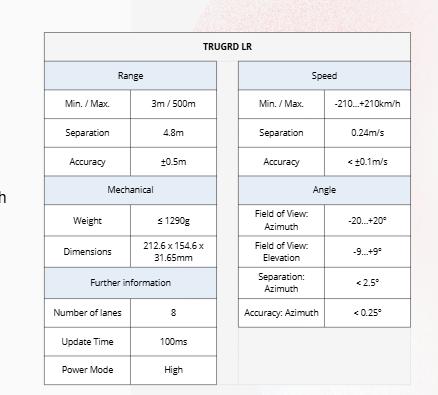

# Raport - RADAR TRUGRD LR
Raport zawiera opis implementacji radaru, jego działania oraz szcegółowe wyjaśnienie funkcji dodającej realistyczny szum.

## Działanie radaru
### Transformacja Przestrzenna i Autokalibracja
Algorytm estymuje odchylenie poprzeczne Yaw poprzez porównanie mediany pozycji w osi X dla punktów w bliskim i dalekim oknie odległości. Przechył Roll jest obliczany poprzez analizę najniżej położonych punktów w osi Z, które reprezentują powierzchnię jezdni .
Aby skorygować perspektywę zaimplementowano macierze obrotu. Wykorzystując funkcje trygonometryczne, skrypt kompensuje zjawiska pochylenia, odchylenia i przechyłu Pitch, Yaw, Roll, rzutując punkty na płaską i prawidłowo zorientowaną płaszczyznę odniesienia.

### Clutter Rejection
W funkcji applyMask zaimplementowano twardy warunek odrzucający wszystkie echa radarowe, dla których prędkość radialna jest równa zeru COLUMN_VELOCITY != 0.
W tej samej funkcji nakładane są limity wzdłużne i pionowe yMin, yMax, zMin, zMax, odrzucające punkty znajdujące się poza maksymalnym zasięgiem radaru.

### Klasteryzacja DBSCAN
Pojedynczy obiekt generuje wiele punktów odbicia. Zaimplementowano algorytm uczenia maszynowego DBSCAN, aby dokonać fuzji tych punktów.
Zanim algorytm połączy punkty, macierz cech X, Y, Z, Vrad jest mnożona przez specyficzne wagi scalingWeights. Parametry takie jak CLUSTER_SCALE_VELOCITY zapewniają, że punkty leżące blisko siebie przestrzennie, ale posiadające różny wektor prędkości (np. dwa mijające się samochody), nie zostaną błędnie połączone w jeden obiekt przestrzenny.
Funkcja getClusterCenters podsumowuje proces, wyliczając średnie wartości współrzędnych, środek geometryczny oraz uśrednioną prędkość dla każdego ze zidentyfikowanych obiektów, klastrów, tworząc dane wejściowe.

##  Funkcja dodająca realistyczny szum
Radar z CARLI przyjmuje idealne wartości położenia punktów, dlatego została zaimplementowana funkcja dodająca realistyczny szum do danych. 
Ze współrzędnych punktu w przestrzeni x, y, z i prędkości radialnej v, obliczamy  współrzęde punktu względem radru dx, dy i dz, przy czym od wartości dz odejmujemy wysokość kamery CAMERA_HEIGHT_OFFSET, aby obliczyć relatywną wysokość punktu względem radaru  
* Dystans - odległość w linii prostej od sensora do obiektu
* Azymut- Kąt płaszczyzny x,y - lewo, prawo względem osi środkowej radaru 
* Elewacja- Kąt nachylenia od osi z -  góra-dół względem horyzontu

`dist = np.sqrt(dx**2 + dy* *2 + dz**2)`

`azimuth = np.arctan2(dx, dy)`

`elevation= np.arctan2(dz, np.sqrt(dx**2 + dy**2))`

Następnie korzystając z parametrów dokładności docelowego radaru:
* Accuracy Azimuth - dokładność azymutu najwyżej 0.25 stopni.
* Accuracy Elevation- dokładność elewacji, nie została podana w metrykach radaru dlatego została przyjęta taka sama wartość jak dla dokładności azymutu 
* Range Accuracy - maksymalny błąd pomiaru odległości najwyżej 0.5 metra 
* Speed Accuracy -  dokładność prędkości radialnej najwyżej 0.1 m/s

obliczamy nowe wartości dystansu, azymutu oraz elewacji poprzez dodanie losowych wartości z przedziału wyżej wymienionych dokładności.

Z tak zaszumionych danych na nowo arytmetycznie obliczamy współrzędne x,y,z naszego punktu w przestrzeni.

`x= n_dist * cos_el * np.sin(n_az)`

`y=n_dist * cos_el * np.cos(n_az)`

`z=(n_dist * np.sin(n_el)) + CAMERA_HEIGHT_OFFSET`

